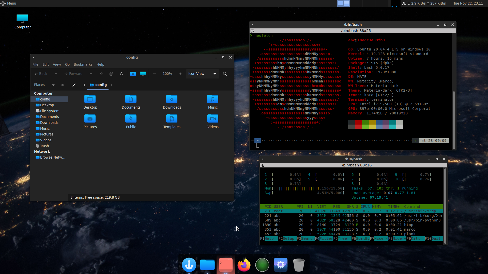

# Ubuntu Desktop Docker

[](https://releases.ubuntu.com/focal/)
[](https://hub.docker.com/r/taltechivarlab/ubuntu-desktop)
[](https://github.com/TalTech-IVAR-Lab/ubuntu-desktop-docker/actions)

> Based on the [linuxserver/rdesktop:ubuntu-mate][rdesktop_github] image by [linuxserver.io][lsio]

Dockerized Ubuntu Desktop environment with RDP and SSH access used by TalTech IVAR Lab. Primarily intended as a base image for our [ROS Desktop][ros_desktop_github] images.

## What's included

In addition to what is already in [linuxserver/rdesktop:ubuntu-mate][rdesktop_github], our image applies the following modifications:

- [OpenSSH] server
- Command line packages:
  - [Terminator] as the default terminal application
  - [Zsh] with [preconfigured plugins][presto-prezto] for the default _abc_ user
  - Utilities:
      - [htop] process monitor
      - [neofetch] system information tool
- GUI packages:
  - [Materia] theme with [Kora] icon pack
  - [Plank] dock
- Desktop look:
  

## Usage

To launch the container directly:

```bash
docker run -d \
  --name=ubuntu-desktop \
  --security-opt seccomp=unconfined `#optional` \
  -e PUID=1000 \
  -e PGID=1000 \
  -e TZ=Europe/London \
  -p 3389:3389 `#rdp` \
  -p 2222:22 `#ssh` \
  --shm-size="1gb" `#optional` \
  --restart unless-stopped \
  -e NVIDIA_VISIBLE_DEVICES=all taltechivarlab/ubuntu-desktop:20.04
```

Once container has started, you must `ssh` into it (default password is `abc`):

```bash
ssh abc@localhost -p 2222
```

...and change _abc_ user's default password following the displayed instructions.

After that, you can use login _abc_ and the newly set password to login to the container using any remote desktop client. 

## Building locally

If you want to build this image locally instead of pulling it from [Dockerhub], clone this repository and run the build:

```bash
docker build -t taltechivarlab/ubuntu-desktop:20.04 .
```

In case you want to build a multi-architecture image (e.g. to run it on a Raspberry Pi), you can build for multiple platforms using the [Docker Buildx][docker_buildx] backend (by specifying them in the `--platform` flag):

```bash
docker buildx build --platform=linux/amd64,linux/arm64 -t taltechivarlab/ros-desktop:noetic --output=oci .
```


[ros_desktop_github]: https://github.com/TalTech-IVAR-Lab/ros-desktop-docker
[lsio]: https://www.linuxserver.io/
[rdesktop_github]: https://github.com/linuxserver/docker-rdesktop
[rdesktop_github_hardware_acceleration]: https://github.com/linuxserver/docker-rdesktop#hardware-acceleration-ubuntu-container-only
[openssh]: https://www.openssh.com/
[terminator]: https://gnome-terminator.org/
[zsh]: https://www.zsh.org/
[htop]: https://htop.dev/
[neofetch]: https://github.com/dylanaraps/neofetch
[presto-prezto]: https://github.com/JGroxz/presto-prezto
[materia]: https://github.com/nana-4/materia-theme
[kora]: https://github.com/bikass/kora
[plank]: https://launchpad.net/plank
[Dockerhub]: https://hub.docker.com/
[docker_buildx]: https://www.docker.com/blog/how-to-rapidly-build-multi-architecture-images-with-buildx/#
